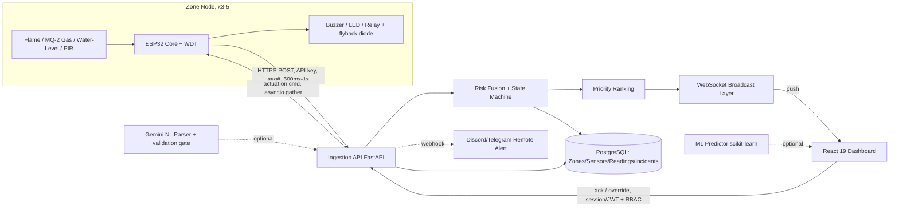

# RoboFusion 1.0 — Agent Context

## Project Summary
Multi-zone hazard-fusion IoT safety grid (RoboFusion 1.0, SCS-RG) spanning 3-5 campus labs. Each zone has an ESP32 with flame, gas, PIR, and water-level sensors; actuators (buzzer, LED, relay). Backend fuses sensor data into a risk score, broadcasts via WebSocket to a React 19 dashboard. Judged by video + source code.

## Architecture

## Naming & Structural Conventions

| Layer | Path | Convention |
|-------|------|-----------|
| FastAPI routers | `backend/app/routers/` | One file per resource: `zones.py`, `readings.py`, `incidents.py`, `auth.py` |
| SQLAlchemy models | `backend/app/models/` | One file per model, named singular |
| Pydantic schemas | `backend/app/schemas/` | `enums.py`, `readings.py`, `zones.py`, `incidents.py` |
| React components | `frontend/src/components/<ViewName>/` | PascalCase per component |
| Firmware sensors | `firmware/src/sensors/` | `flame_gas.h/.cpp`, `pir.h/.cpp`, `water.h/.cpp` |
| Firmware actuators | `firmware/src/actuators/` | TBD in Prompt 13 |

## Entity List

- **Zone**: One per physical lab. FK: referenced by sensors, readings, incidents.
- **SensorReading**: One row per sensor poll. FK to Zone via Sensor.
- **Incident**: One row per SAFE→WARNING/CRITICAL transition. FK to Zone.
- **User**: Staff or admin role. FK: `acknowledged_by` on incidents.

## Non-Functional Constraints

- Sensor poll cadence: 500ms–1s
- CRITICAL actuation budget: 1 second (Test Case 5)
- WebSocket broadcast: must not drop/interleave under concurrent state changes (Test Case 7a)
- Acknowledgment writes: must be race-safe (Test Case 7b, use `ON CONFLICT DO NOTHING`)
- All money/precision: N/A for this project

## Git Conventions

- Conventional Commits: `feat:`, `fix:`, `chore:`, `docs:`, `ci:`
- One feature per branch, branch prefixes matching commit types
- Branch from `main`, merge back via PR

## Work Completed So Far

- **Prompts 0–8:** Project context, agent routing, Antigravity bootstrap, DB schema (5 tables, native enums, composite index), Pydantic domain models, and core hardware/firmware setup.
- **Prompt 23 (Figma UI & Tokens Merge):** Integrated Figma SCS-RG design system, two-layer design token architecture (`tokens.css`, `theme.css`), 48 UI components, status chip maps, and interactive Frame Gallery into `frontend/`.
- **Prompt 24 (`feat/react-app-shell` / PR #38):** Built React 19 app shell with `createBrowserRouter`, in-memory `authStore` (Zustand), `uiStore`, `liveZoneStore`, root WebSocket hook `useDashboardSocket` (exponential backoff 1s–30s), `RequireAuth` & `RequireRole` route guards, role-gated `Sidebar` (omitting `System Health` from DOM for `STAFF`), `LoginView` with password peek toggle, and Vite reverse proxy (`/api` & `/ws` to `http://localhost:8000`).
- **Prompt 25 (`feat/zone-map-view` / PR #40):** Built live zone map view (`ZoneMapView.tsx`) with Idle/Loading skeleton grid, Success real zone hydration via `GET /api/v1/zones`, Degraded hatched overlay on WS reconnect, per-zone 5s staleness check to `OFFLINE` status (with audit logging), per-tile hazard sub-indicators (fire/gas/water > 5.0, occupancy > 1.0), and inline Error banner with Retry.
- **Prompt 26 (`feat/priority-queue-rail` / PR #41):** Built persistent priority queue rail (`PriorityQueueRail.tsx`) mounted in `AppLayout` shell with Bearer JWT auth, debounced 250ms refetch on WS `zoneStates` updates, `All-Nominal` checkmark card state, hover/tap inline risk-breakdown expansion, and optimistic incident acknowledgment calling `POST /api/v1/incidents/{id}/acknowledge`.
- **Prompt 27 (`feat/top-bar` / PR #42):** Built top bar (`TopBar.tsx`) mounted once in shell with route-to-title map (`Zone Map`, `Incident History`, `System Health`), system-state summary pill (`{safe} zones nominal, {attention} zones need attention`), live connection indicator, mute toggle bound to `uiStore`, and admin-only "Ack all" button firing `Promise.all` over unacknowledged `CRITICAL` incidents.
- **Prompt 28 (`feat/critical-alert-motion-layer` / PR #43):** Built critical-alert motion layer (`CriticalAlertMotionLayer.tsx`, `ToastStack.tsx`, `criticalAudioCue.ts`, `critical-motion.css`) with single-source `criticalTransitions` queue in `liveZoneStore`, Web Audio API dual-tone sequence (523.25 Hz -> 622.25 Hz, respecting `uiStore.isMuted`), toast stack management, `.critical-entrance` spring animation, permanent `.critical-active` red border, and instant toast dismissal on incident acknowledgment.
- **Prompt 29 (`feat/websocket-offline-threshold` / PR #44):** Extended `useDashboardSocket.ts` with `OFFLINE_AFTER_CONSECUTIVE_FAILURES = 6` threshold setting `connectionStatus` to `"offline"` upon sustained reconnect failures, exported `forceReconnect()` helper to cancel timers and re-attempt socket creation immediately, and updated `ZoneMapView.tsx` with `"Live connection lost — still retrying automatically"` banner and manual `forceReconnect()` Retry action.
- **CI/CD Hardening:** Updated `.github/workflows/build.yml` with `--legacy-peer-deps`, created `frontend/.npmrc`, and fixed Ruff `BLE001` linter checks in `security.py`. All CI checks pass 100% green.

## Mandatory Pre-Push Directives (CRITICAL)

- **ALWAYS check CI/CD workflows locally before pushing:** Before making any git commit or pushing to remote, the agent MUST run and verify local build/lint commands:
  - Backend: `python -m ruff check backend/`
  - Frontend: `npm run build` inside `frontend/`
- Do NOT push any branch until both checks pass cleanly with 0 errors.

## AI Tooling

- **OpenCode**: primary agent. OpenRouter is authenticated globally via `opencode auth` (stores in `~/.local/share/opencode/auth.json`) — no project-level env vars needed.
- **Antigravity**: scarce-quota fallback agent. Reserved for specific prompts only (see below).
- **Figma Make**: Prompt 23 only (screen generation). Requires Figma Variables from Prompt 4.

## AI Agent Routing

| Prompt # | Purpose | Allowed Agent |
|----------|---------|--------------|
| 14 | Risk Fusion | Antigravity |
| 17 | WebSocket Broadcast Lock | Antigravity |
| 36 | ML Predictor (Bonus 3) | Antigravity |
| 37 | NL Incident Parser (Bonus 4) | Antigravity |
| All others | General development | OpenCode (free models) |

- Do not use Antigravity for any prompt not listed above unless all four reserved prompts are already complete and quota remains.

## CI

- PRs into `main` must pass the build workflow (`.github/workflows/build.yml`).
- **Agents must always execute local lint/build validation prior to pushing.**
- Branch-protection rule must be toggled manually in repo settings.

## Do Not

- Don't push code without running local linter (`ruff check backend/`) and build (`npm run build`) checks first.
- Don't store JWTs in `localStorage` — use httpOnly cookies or in-memory Zustand store.
- Don't use a naive `for ws in connections: await ws.send()` broadcast loop — use a lock or per-client task.
- Don't use SELECT-then-INSERT for acknowledgment writes — use `ON CONFLICT DO NOTHING`.
- Don't leave the water-level sensor's VCC pin continuously energized — duty-cycle via `WATER_POWER_PIN`.
- Don't skip the ESP32 watchdog's `delay(1)` loop yield.
- Don't route risk-fusion formula, priority sort, or duplicate-sequence check through an LLM call — all three are deterministic arithmetic/comparison.
